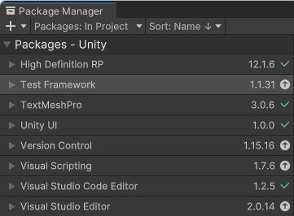
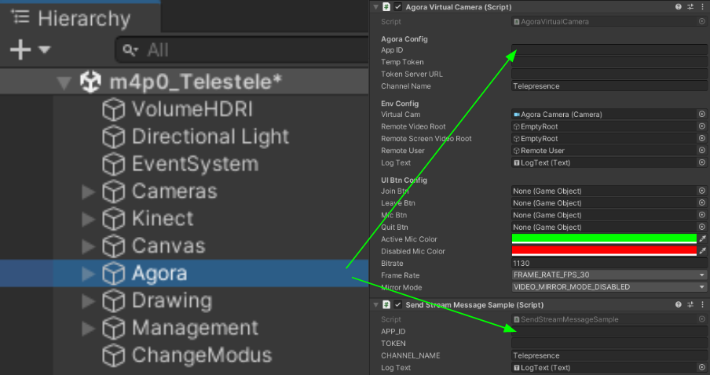

# INSIDEOUT

## Inhaltsverzeichnis
* [Kurzbeschreibung](#Kurzbeschreibung)
* [Förderhinweis](#Förderhinweis)
* [Installation](#Installation)
* [Benutzung](#Benutzung)
* [Beteiligung](#Beteiligung)
* [Credits](#Credits)
* [Lizenz](#Lizenz)

## Kurzbeschreibung
Telepresence-Anwendungen können ein Gefühl von sozialer Verbundenheit erzeugen, während sie gleichzeitig mehrere Orte miteinander verbinden. Die Installation INSIDEOUT nutzt dieses Potenzial und ermöglicht Besuchenden ein soziales Lernerlebnis über die physikalischen Museumsgrenzen hinaus. In dem geräuschlosen Scharade-Spiel können sich zwei Nutzende gegenseitig Exponate mittels Pantomime oder Malen erklären. Dies ermöglicht auch Besuchenden ohne Begleitung den sozial Austauschen mit anderen und hilft ihnen dabei, gemeinsam prägnante Eigenschaften von Objekten zu identifizieren. Dank der implementierten Hand-Tracking-Steuerung ist die gesamte Interaktion berührungslos und somit hygienisch möglich.

## Förderhinweis
Diese native Anwendung ist entstanden im Verbundprojekt museum4punkt0 – Digitale Strategien für das Museum der Zukunft,
Teilprojekt Museum INSIDE/OUT. Das Projekt museum4punkt0 wird gefördert durch die Beauftragte der Bundesregierung für Kultur
und Medien aufgrund eines Beschlusses des Deutschen Bundestages. Weitere Informationen:\
www.museum4punkt0.de

 

## Installation und Benutzung
Für die Installation der Anwendung wird neben der bereitgestellten Software auch Hardware benötigt. Prozesse werden im Folgenden beschrieben:

**Hardware**
Hardwareseitig werden für die Umsetzung folgende Komponenten pro Station benötigt:
* PC (>= Windows 10, Systemanforderungen von [Unity](https://docs.unity3d.com/Manual/system-requirements.html) und [Azure Kinekt DK](https://learn.microsoft.com/de-de/azure/kinect-dk/system-requirements) beachten)
* Min. ein Bildschirm (1920x1080)
* [Azure Kinect DK](https://learn.microsoft.com/de-de/azure/kinect-dk/)
* Halterungen (Bildschirm und Azure Kinect DK)
* Sonstiges (Kabel, Maus, Tastatur etc.)

Zunächst werden die Halterungen so aufgebaut, dass sowohl der Bildschirm als auch die Azure Kinect DK im 90°-Winkel senkrecht montiert werden können. Die Azure Kinect DK muss sich dabei ungefähr auf Augenhöhe der Nutzenden und auf horizontaler Achse der Bildschirmmitte (bevorzugt über dem Bildschirm) befinden. Die Halterung sollte so gewählt werden, dass sie im Nachgang nach Bedarf noch justiert werden kann. Anschließend können alle Komponenten wie von den jeweiligen Herstellern angegeben miteinander verbunden werden.

**Software**
1. Softwareseitig müssen für die Umsetzung folgende Komponenten pro Station neben diesem Repository installiert werden:
* [Unity](https://unity.com/de) (Version 2021.3.2f1)
* [Azure Kinect SDK](https://learn.microsoft.com/de-de/azure/kinect-dk/set-up-azure-kinect-dk)
* [Azure Kinect Body Tracking SDK](https://learn.microsoft.com/de-de/azure/kinect-dk/body-sdk-setup)
* Import der [Azure Kinect Examples for Unity](https://assetstore.unity.com/packages/tools/integration/azure-kinect-examples-for-unity-149700#content) in Unity
* Folgende Packages sollten installiert sein:\
\

2. Anschließend müssen folgende Schritte für die Kommunikation zwischen den Stationen durchgeführt werden:
* Erstellung eines [Agora](https://www.agora.io/en/)-Accounts abhängig von den jeweiligen Anforderungen
* Ein neues Projekt kann anschließend erstellt werden unter: Developers > Project Management > Create a Project > Configure
* Hier benötigen wir die App ID
* In Unity befindet sich die Szene unter: Assets > Scripts > Scenes > m4p0_Telestele
* Die App ID muss unter „Agora > Agora Virtual Camera > App ID“ in der Hierachy eingesetzt werden sowie unter „Agora > Send Stream Message Sample > APP_ID“
* Abschließend kann das Projekt gebuildet und gestartet werden.\
\

Wichtig: Damit die Anwendung läuft, muss die gleiche App ID eingefügt worden sein. Es sollten stets nur je zwei Stationen mit der gleichen App ID (bzw. Channel-Namen) laufen.

## Benutzung
Ein umfangreiches Tutorial ist Teil der Anwendung. Durch Auswahl des Branches kann entweder eine Version mit Text-Beschreibung (master) oder mit erklärenden Animationen (animation) heruntergeladen werden.

## Beteiligung
Um eigene Objekte zu verwenden, können im Ordner „Assets > Resources > Museumsobjects“ PNG-Dateien von Exponaten hochgeladen werden. Hierbei ist wichtig zu beachten, dass der Dateiname der verwendeten Bilder eine Zahl ist und alle Bilder fortlaufend ab „0“ (Null) in aufsteigender Reihenfolge benannt werden müssen. Die Information zum Objekt können unter „Assets > Resources > JsonObjects“ in der JSON-Datei ergänzt werden.

Mögliche Future Work:
* Netzwerkkommunikation über einen eigenen Server unabhängig von Agora
* Management für mehr als zwei Museen gleichzeitig
* Ergänzen der Beschreibungen in mehreren Sprachen

## Credits
Auftraggeber: Deutsches Museum, museum4punkt0\
Konzept: Clara Sayffaerth, Gabriel von Münchow, Alexander Schmidt\
Gestaltung & Entwicklung: Clara Sayffaerth, Gabriel von Münchow\
Objekte: Deutsches Museum, Germanisches Nationalmuseum

## Lizenz
Copyright © 2023, Deutsches Museum\
Hiermit wird jeder Person, die eine Kopie dieser Software und der zugehörigen Dokumentationsdateien (die "Software") erhält, kostenlos die Erlaubnis erteilt, uneingeschränkt mit der Software zu handeln, einschließlich und ohne Einschränkung der Rechte zur Nutzung, zum Kopieren, Modifizieren, Zusammenführen, Veröffentlichen, Verteilen, Unterlizenzieren und/oder Verkaufen von Kopien der Software, und Personen, denen die Software zur Verfügung gestellt wird, dies unter den Bedingungen der MIT-Lizenz zu gestatten.
